# Distributed NMPC + ESO + GCBF Safety Framework for Multi-Agent Systems

This repository extends the original **GCBF+** project by integrating:

- **Nonlinear Model Predictive Control (NMPC)** with warm-started Ipopt
- **Extended State Observers (ESO)** for real-time disturbance estimation and compensation
- **Graph-based prediction** of multi-agent interaction over the MPC horizon
- **GNN-based Control Barrier Functions (GCBF)** for distributed safety enforcement
- **Fallback GCBF-QP safety filter** when NMPC fails
- **Visualization, debugging, and analysis tools**

The original upstream GCBF+ repository is preserved in **`orig_README.md`** for reference.

---

## 🎬 Demo

<div align="center">
    
    
</div>
  
<div align="center">
    
    
</div>

---

## 📦 Project Structure

```text
Project/
├── Tester/
│   └── test_ESO_NMPC_gcbf.py
│       ├── PersistentMPCController
│       ├── DistributedMPCController
│       ├── LocalSubgraphExtractor
│       ├── ESOSQPSafetyMPC
│       └── ESOGCBFTester
│
├── Pipeline/
│   ├── graph_predictor.py
│   │   ├── PerceivedWalls
│   │   └── MPCGraphPredictor
│   │
│   ├── graph_evaluator.py
│   │   └── CBFEvaluator
│   │
│   ├── gcbf_mpc_solver.py
│   │   └── NLPMPCController
│   │
│   └── safe_fallback_controller.py
│       └── SafeFallbackController
│
└── analysis_debug/
    ├── CBF_Cost_field_visualizer.py
    ├── Graph_prediction_test_gradient.py
    ├── obstacle_debugging.py
    ├── ESO_tuning.py
    ├── visualize_local_graphs.py
    ├── visualize_full_graphs.py
    └── visualize_status_axis_ipopt.py
```

---

## 🏗️ System Architecture

### Design Diagram

<div align="center">
    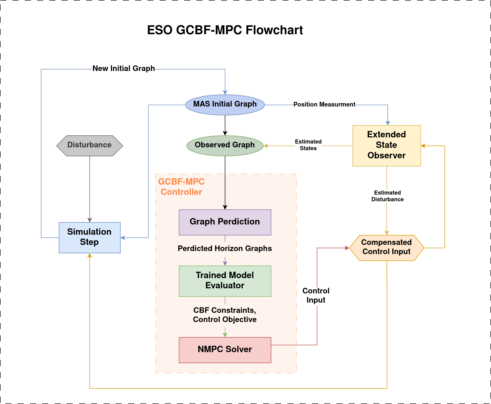
</div>

### Implementation Layout

<div align="center">
    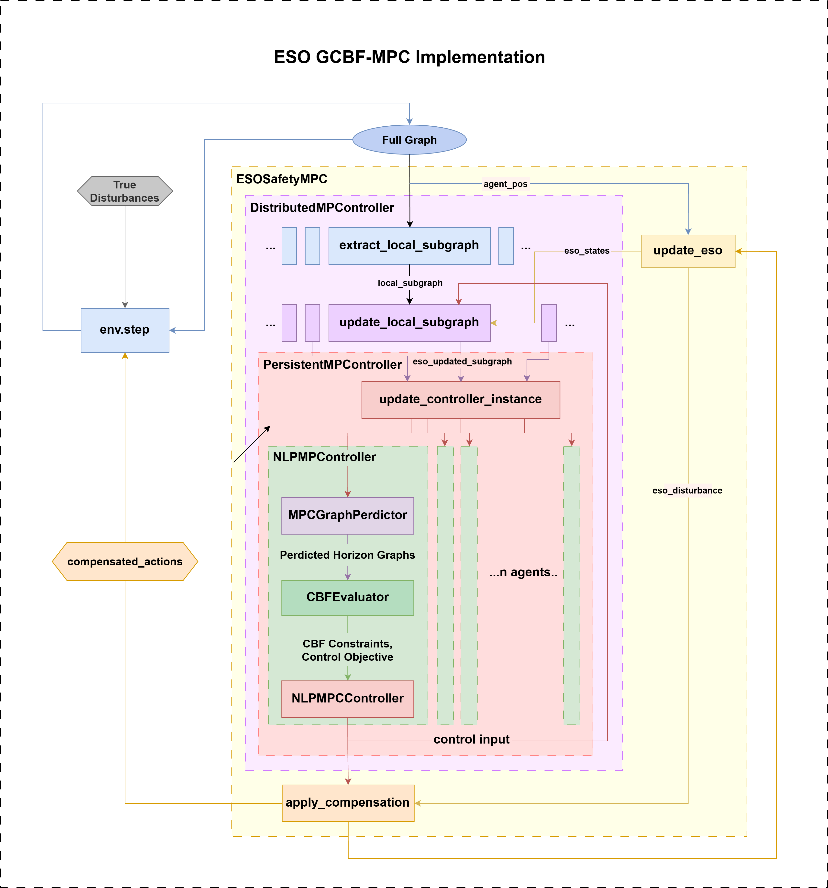
</div>

---

## 🧩 Module Overview

### **Tester**

#### `test_ESO_NMPC_gcbf.py`
Main simulation driver integrating ESO, NMPC, graph prediction, and GCBF-based safety.

- **PersistentMPCController**  
  Wrapper for controller. Reuses the same solver instance across iterations for each agent.

- **DistributedMPCController**  
  Runs per-agent subgraph extraction, and subgraph state updates from ESO observations.

- **LocalSubgraphExtractor**  
  Extracts each agent's local perception graph from the global graph, enabling decentralized decision-making based on locally relevant information.

<div align="center">
    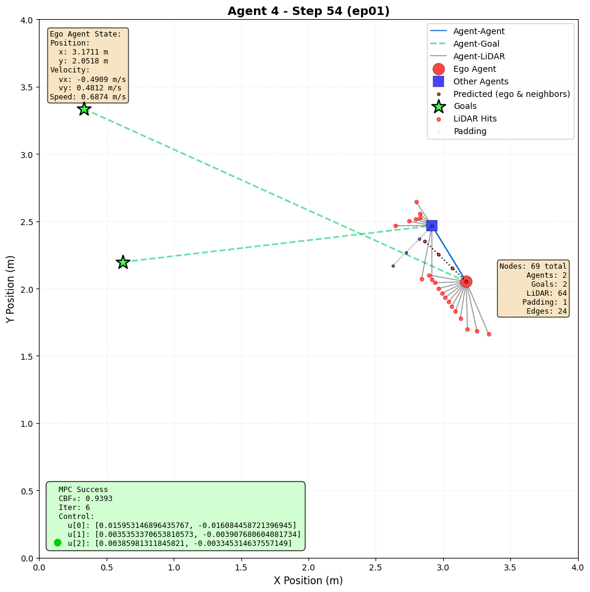
    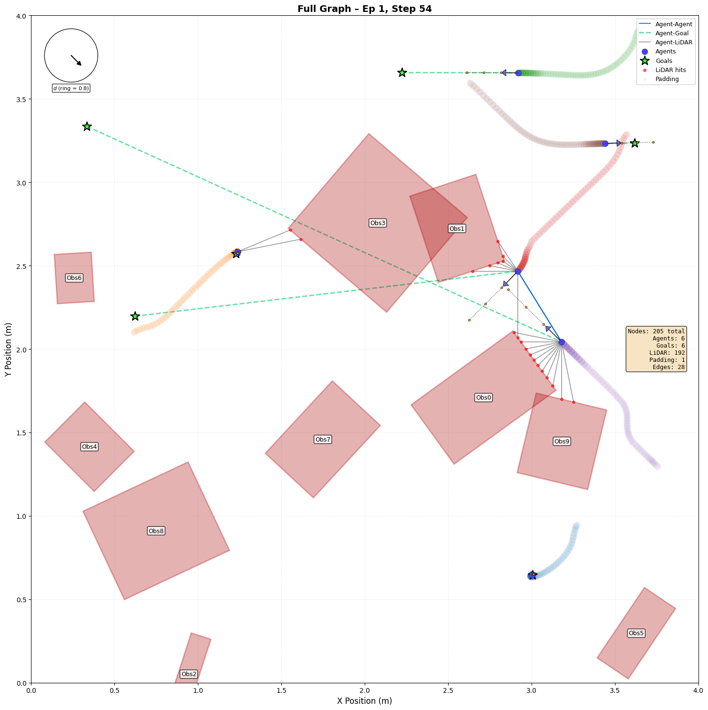
    <br>
    <em>Local vs Global graph perspective</em>
</div>

- **ESOSQPSafetyMPC**  
  Maintains ESO state and applies disturbance-compensation logic inside MPC.

- **ESOGCBFTester**  
  Initializes and runs simulation episodes, handles logging, visualization, and video generation.

---

### **Pipeline**

#### `graph_predictor.py`
Predicts graph evolution along the MPC horizon.

- **PerceivedWalls**  
  Converts graph based lidar perception of obstacle geometry into polygonal "perceived walls" with corner detection.

- **MPCGraphPredictor**  
  Propagates agent dynamics + perceived geometry into predicted future graphs.

<div align="center">
    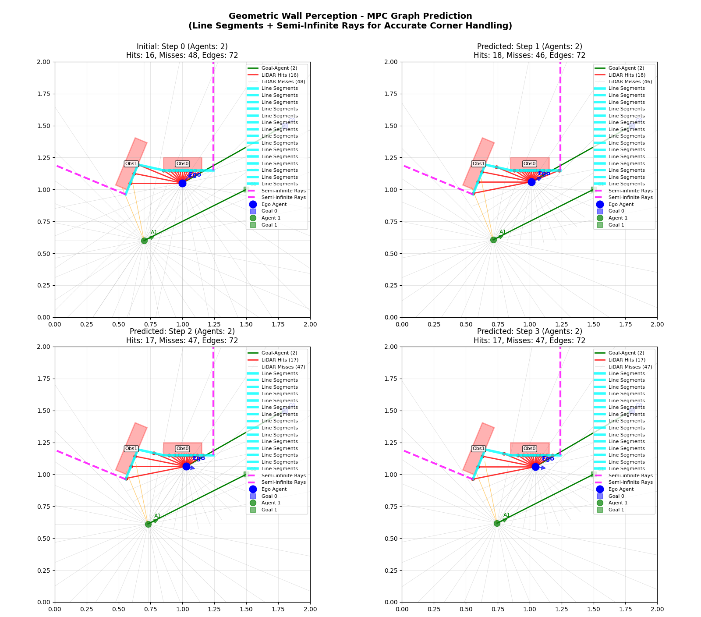
    <br>
    <em>Graph prediction with perceived obstacles and edge detection</em>
</div>

<div align="center">
    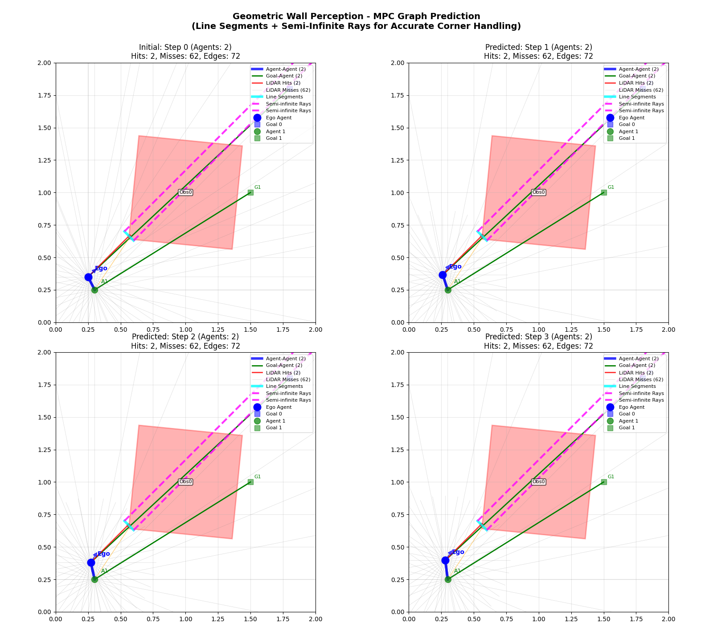
    <br>
    <em>Single hit assumption to encourage approaching for more obstacle info</em>
</div>

#### `graph_evaluator.py`
Generates GCBF-based safety constraints.

- **CBFEvaluator**  
  Computes CBF values and gradients of local subgraphs using a trained GNN.

#### `gcbf_mpc_solver.py`
Nonlinear MPC formulation and solver loop.

- **NLPMPCController**  
  Initializes warm-started NMPC, integrates graph prediction and GCBF-based constraints, and invokes IPOPT.

<div align="center">
    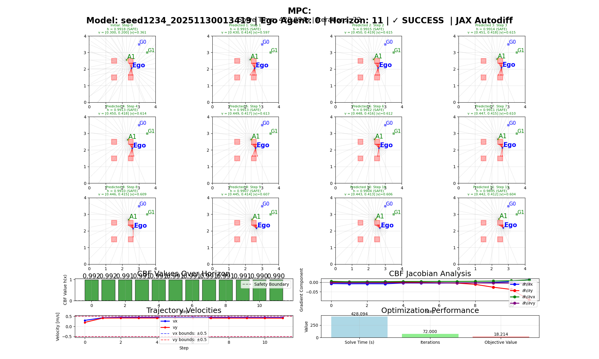
    <br>
    <em>IPOPT solution for single step</em>
</div>

#### `safe_fallback_controller.py`
Runtime safety fallback.

- **SafeFallbackController**  
  Continuous-time GCBF-QP controller executed when IPOPT fails, ensuring minimum safety guarantees.

---

### **Analysis & Debugging Tools**

#### `CBF_Cost_field_visualizer.py`
Visualizes CBF contours, gradient fields, and cost landscapes.

<div align="center">
    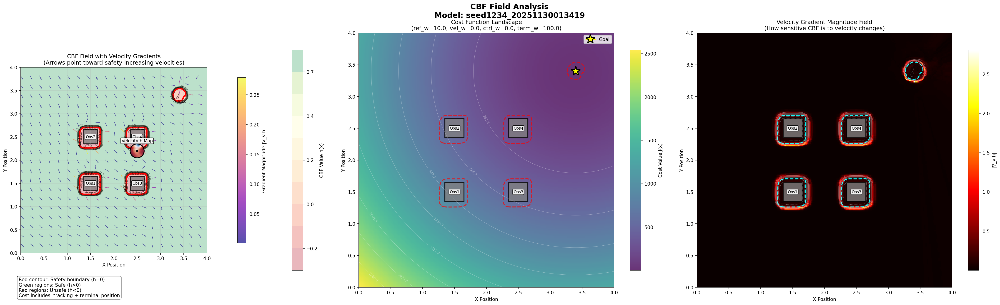
    <br>
    <em>CBF field visualization of trained model</em>
</div>

#### `Graph_prediction_test_gradient.py`
Displays predicted graph evolution for a chosen control sequence.

#### `obstacle_debugging.py`
Visualizes obstacle detection and logged geometric perception.

#### `ESO_tuning.py`
Allows offline tuning of ESO using recorded real inputs and trajectories.

<div align="center">
    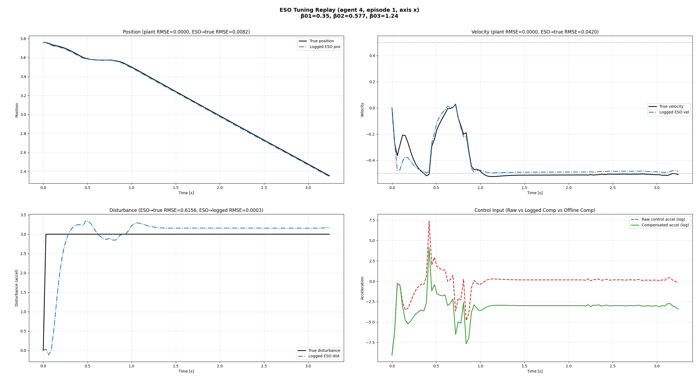
    <br>
    <em>Tuned observer tracking performance</em>
</div>

#### `visualize_local_graphs.py`
Visualizes presolve local subgraphs and solved control inputs.

<div align="center">
    
    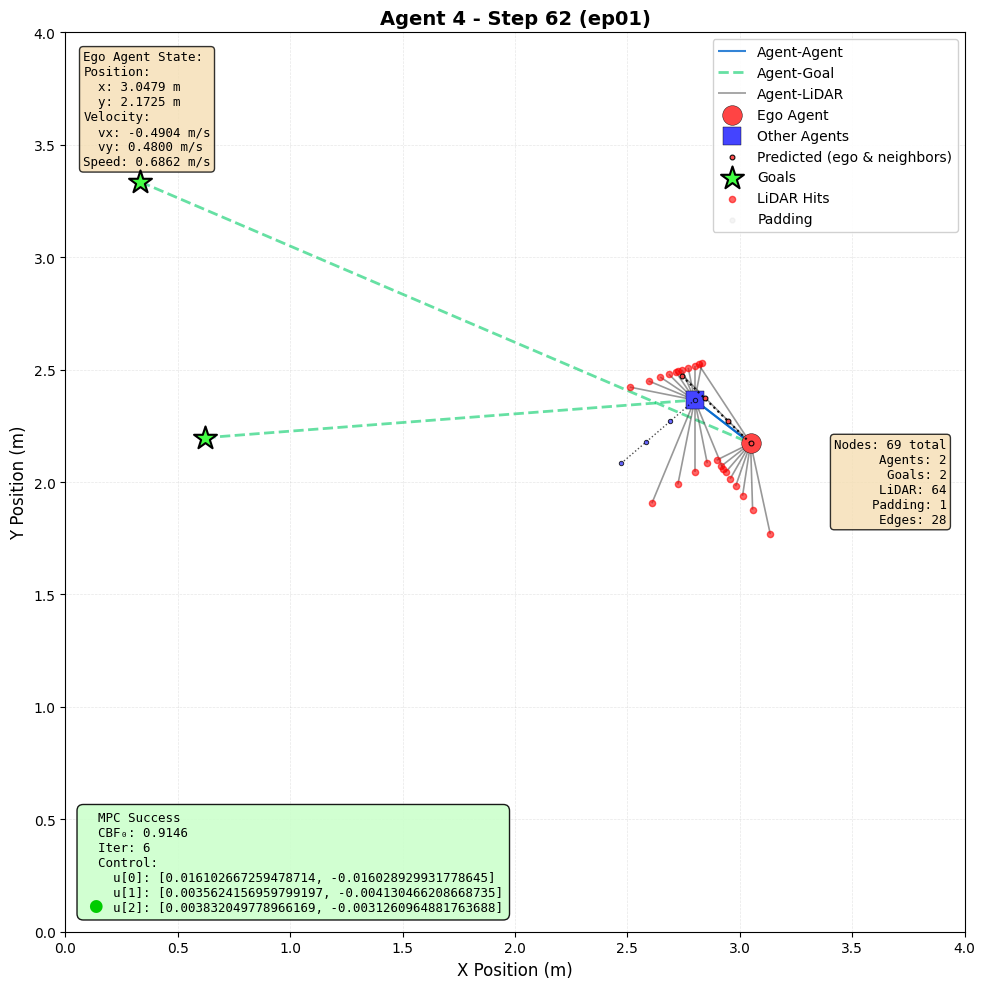
    <br>
    <em>Local graph evolution over time</em>
</div>

#### `visualize_full_graphs.py`
Visualizes logged global graphs for each step with control inputs, disturbance, and movement trajectory.

<div align="center">
    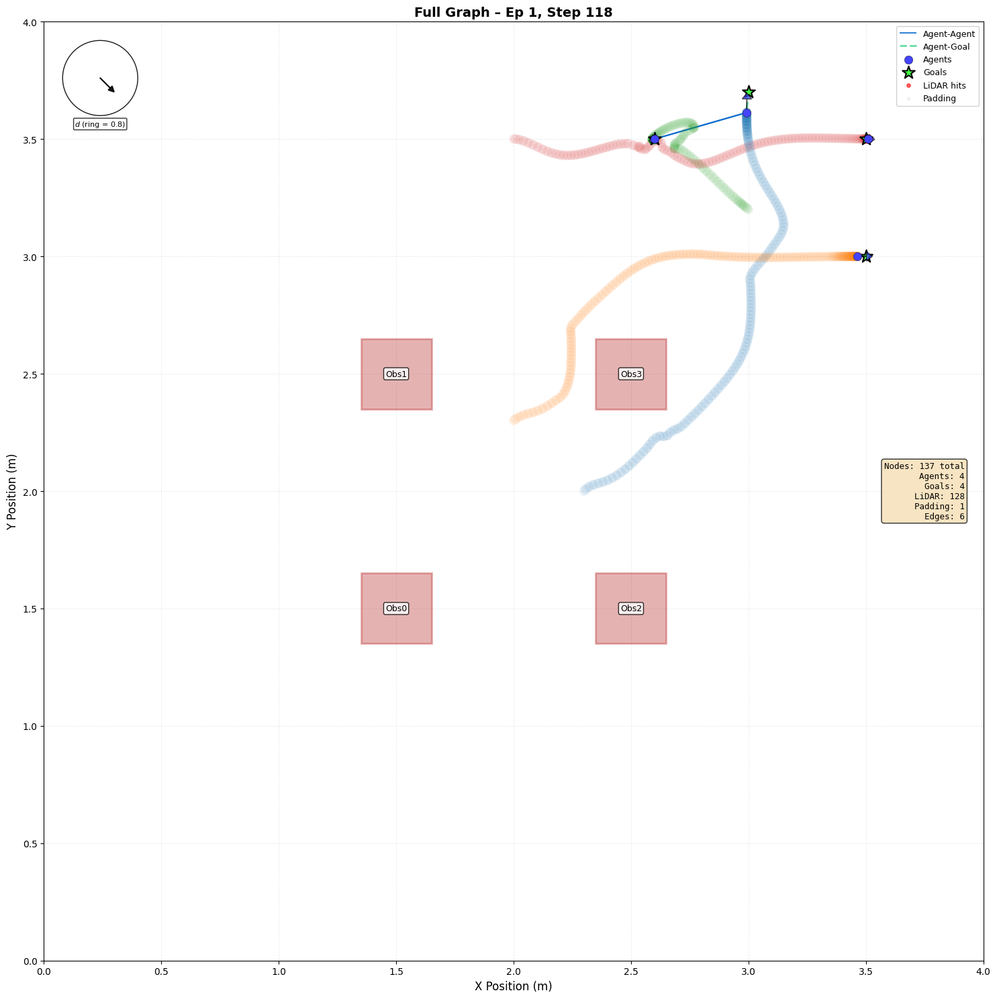
    
    <br>
    <em>Trail visualization: Manual (left) vs Random (right) scenarios</em>
</div>

#### `visualize_status_axis_ipopt.py`
Plots solver iteration count and IPOPT status across steps.

<div align="center">
    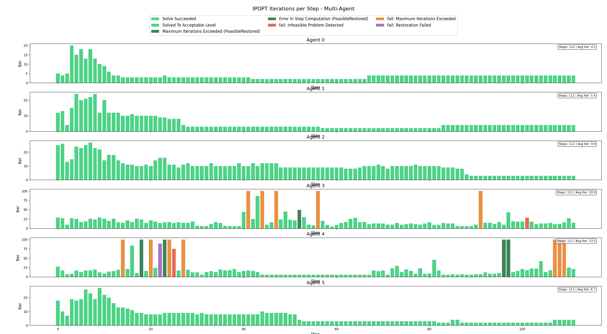
    <br>
    <em>Status axis showing iteration count and solver status</em>
</div>

---
## 🔧 Installing Requirements

Create the following environment along with the required packages:

```bash
python test_ESO_NMPC_gcbf.py \
  --gcbf-path logs/DoubleIntegrator/gcbf+/seed1234_20251130013419 \
  --manual-scenario \
  --epi 1 \
  --max-step 400 \
  --mass 0.1 \
  --safety-margin 0.0 \
  --mpc-horizon 3
```

## 🚀 Running the Simulation

### Train GCBF Model
Train a GCBF model:

```bash
python train.py \
  --algo gcbf+ \
  --env DoubleIntegrator \
  -n 8 \
  --area-size 4 \
  --loss-action-coef 1e-4 \
  --n-env-train 4 \
  --n-env-test 16 \
  --lr-actor 1e-5 \
  --lr-cbf 1e-5 \
  --horizon 24 \
  --steps 4000 \
  --seed 1234 \
  --save-interval 100
```


### Manual Scenario
Run simulation with a manually configured scenario:

```bash
python test_ESO_NMPC_gcbf.py \
  --gcbf-path logs/DoubleIntegrator/gcbf+/seed1234_20251130013419 \
  --manual-scenario \
  --epi 1 \
  --max-step 400 \
  --mass 0.1 \
  --safety-margin 0.0 \
  --mpc-horizon 3
```

### Random Scenario
Run simulation with random obstacle and agent placement:

```bash
python test_ESO_NMPC_gcbf.py \
  --gcbf-path logs/DoubleIntegrator/gcbf+/seed1234_20251130013419 \
  --area-size 4.0 \
  --epi 1 \
  --obs 10 \
  --num-agents 6 \
  --max-step 500 \
  --mass 0.1 \
  --safety-margin 0.0 \
  --mpc-horizon 3 \
  --seed 1111
```

---

## 📊 Analysis & Debugging

### Show Solver Status Timeline

Visualize IPOPT iteration counts and solver status for specific agents:

```bash
python -m analysis_debug.visualize_status_axis_ipopt \
  logs/eso_mpc_gcbf_results_lazy/1211-0240 \
  --step-range 0 200 \
  --agents 0 1 2 3 4 5 \
  --combined \
  --show
```

### Visualize Local Graphs

View local subgraph evolution for a specific agent over time:

Generates local graph images under logs/eso_mpc_gcbf_results/MMDD-HHMM/local_graph_logs/visualizations

```bash
python -m analysis_debug.visualize_local_graphs \
  logs/eso_mpc_gcbf_results_lazy/1211-0240/local_graph_logs \
  --agent 3 \
  --step-range 0 500 \
  --axis-mode fixed \
  --axis-limits -0 4 -0 4
```

### Visualize Full Graphs

View simulation results including mpc inputs, disturbance and agent trajectories:

Generates full graph visualizations under logs/eso_mpc_gcbf_results/MMDD-HHMM/full_graph_logs/visualizations

```bash
python -m analysis_debug.visualize_full_graphs \
  logs/eso_mpc_gcbf_results_lazy/1211-0240/full_graph_logs \
  --episode 1 \
  --step-range 0 400 \
  --axis-mode fixed \
  --axis-limits 0 4 0 4 \
  --animate
```

### ESO Tuning

Perform offline ESO tuning on logged trajectories:

```bash
python -m analysis_debug.ESO_tuning \
  --log-dir logs/eso_mpc_gcbf_results_lazy/1211-0240 \
  --agent-id 4 \
  --episode 1 \
  --axis x
```

Additional tuning runs:

```bash
python -m analysis_debug.ESO_tuning \
  --log-dir logs/eso_mpc_gcbf_results_lazy_manual/1210-0403 \
  --agent-id 0 \
  --episode 1 \
  --axis x
```

### Test Graph Prediction

Visualize graph prediction module behavior:

```bash
python -m analysis_debug.Graph_prediction_test_gradient
```

### Test Graph Evaluation

View simulation results including mpc inputs, disturbance and agent trajectories:

```bash
python python -m pipeline.graph_evaluator \
  --model-path logs/DoubleIntegrator/gcbf+/seed1234_20251130013419 \
  --ego-idx 0 \
  --test
```

### Test Solver Module

View simulation results including mpc inputs, disturbance and agent trajectories:

```bash
python python -m pipeline.gcbf_mpc_solver
```

---

## 📝 Notes

- All logged results are stored under `logs/` with timestamped subdirectories
- The `--gcbf-path` should point to your trained GNN model directory
- ESO parameters can be tuned offline using logged data before deploying online
- Fallback controller activates automatically when IPOPT fails to find a feasible solution

---

## 📄 License

This repository includes code from the **GCBF+** project (MIT REALM Lab).

- **Upstream license:** Files originating from GCBF+ are covered by the upstream license (see `LICENSE`).
- **Attribution:** Portions of this codebase originate from GCBF+ and remain subject to the upstream copyright and license terms.
- **Extensions:** New NMPC / ESO / integration code added in this repository is currently **unlicensed / all rights reserved** until an explicit license is chosen and applied (this section will be updated accordingly).

> If you redistribute this repository, keep the upstream license text intact and retain attribution to the original GCBF+ authors.


## 📚 Citation

If you use this work, please cite the upstream paper:

### Upstream paper (GCBF+)

```bibtex
@article{zhang2025gcbfplus,
  author  = {Zhang, Songyuan and So, Oswin and Garg, Kunal and Fan, Chuchu},
  journal = {IEEE Transactions on Robotics},
  title   = {{GCBF+}: A Neural Graph Control Barrier Function Framework for Distributed Safe Multiagent Control},
  year    = {2025},
  volume  = {41},
  pages   = {1533--1552},
  doi     = {10.1109/TRO.2025.3530348}
}


